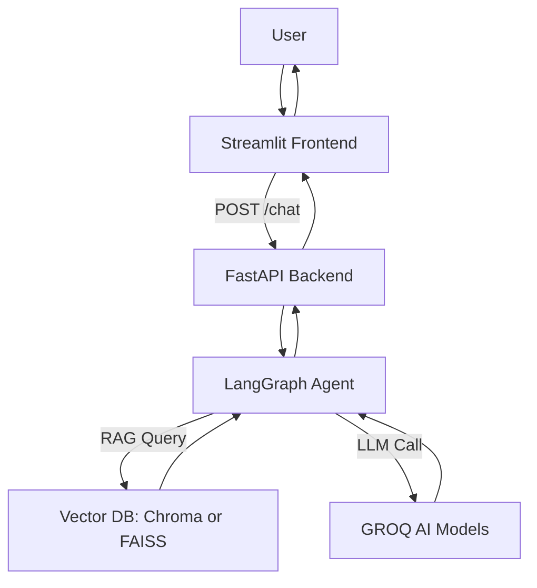

# Iron Lady Chatbot

An AI-powered **Leadership Essentials Chatbot** built using **LangGraph, FastAPI, Streamlit, and Vector Databases**.  
The chatbot helps users explore programs from [IamIronLady.com](https://iamironlady.com/individualPrograms/Leadership_Essentials_Program), recall conversations, and provide an interactive Q&A experience.  

---

##  Features
- **RAG (Retrieval-Augmented Generation):** Answers questions from Leadership Essentials Program content.  
- **LangGraph Memory:** Keeps track of conversation history with persistence.  
- **FastAPI Backend:** Handles chatbot requests via REST API.  
- **Streamlit Frontend:** Simple and interactive UI for users.  
- **Vector DB Integration:** Stores and retrieves program knowledge for accurate answers.  

---

##  Tech Stack  

- **Frontend:** Streamlit  
- **Backend:** FastAPI  
- **Agent Framework:** LangGraph + LangChain  
- **LLMs:** Groq (`meta-llama/llama-4-maverick-17b-128e-instruct`)
- **Vector DB:** Chroma / FAISS  
- **Persistence:** LangGraph MemorySaver
- **Environment:** Python 3.10+

---

##  Architecture  



---

##  Installation & Setup

1. **Clone the repo**
```bash
git clone https://github.com/your-username/IRON-LADY-CHATBOT.git
cd IRON-LADY-CHATBOT
```

2. **Create virtual environment & activate**
```bash
python -m venv venv
source venv/bin/activate    # Linux/Mac
venv\Scripts\activate       # Windows
```

3. **Install dependencies**
```bash
pip install -r requirements.txt
```

4. **Setup environment variables**
Create a .env file in the project root:
```ini
GROQ_API_KEY=your_openai_key_here
```

5. **Run Backend (FastAPI)**
```bash
uvicorn backend:app --reload --host 127.0.0.1 --port 8000
```

6. **Run Frontend (Streamlit)**
```bash
streamlit run ui.py
```
Access:
- Streamlit UI → http://localhost:8501
- FastAPI Docs → http://127.0.0.1:8000/docs

---

##  Roadmap / Future Enhancements

- Add multi-program support (Advanced Leadership, Corporate Programs).

- Expand knowledge base with automatic web scraping from Iron Lady website.

- Add authentication (JWT/OAuth) for secure access.

- Integrate speech-to-text + text-to-speech for voice chatbot.

- Deploy on AWS/GCP/Azure with Docker & CI/CD.

